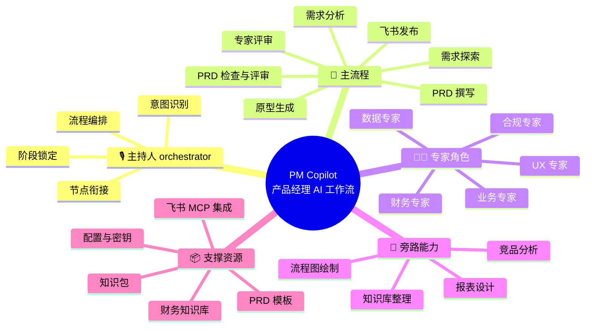

# PM Copilot 使用说明（SOP）

> 面向使用这套工作流的产品经理与团队，说明「它是什么、怎么用、怎么让它帮你装好」。

---

## 0. 这是什么

一套**产品经理专用的 AI 工作流**，以 Skills 形式组织，覆盖从原始需求到 PRD、原型、飞书发布的全链路。可在 Claude Code、Codex、Kiro、DeepSeek harness 等 agent 工具中运行。

| 你的痛点 | 它帮你 |
|---------|--------|
| 需求说不清、老返工 | 渐进式提问 + 多专家评审，一次想清楚 |
| PRD 格式不统一 | 内置标准模板（含报表专用模板） |
| 评审时才发现问题 | 提前模拟四角色评审 |
| PRD 到原型要等设计 | PRD 自动转可点击 HTML 原型 |
| 写文档费时间 | 一键发布飞书（可选） |

> 安全边界：默认本地生成、默认私有、默认不通知。外部写入、公开、通知都需你的明确确认。

---

## 1. 工作流架构（脑图）

- **根**：PM Copilot 工作流
- **🎙️ 主持人**：编排中枢，识别意图、调度技能、把控节奏
- **🔄 主流程**：一条需求从进来到发布飞书的完整链路
- **🧑‍💼 专家角色 / 🔧 旁路能力 / 📦 支撑资源**：三个维度支撑主流程

---

## 2. 十步流程（人机分工）

> 每步标注 **👤 你**（人要给的输入、要做的决策）和 **🤖 AI**（AI 的输入、动作、输出）。

### 步骤 1 · 需求输入

> 🎯 把需求交给主持人，由它判断从哪开始

- **👤 你**：发来需求 → 一句话想法 / 文字描述 / 文档 / 截图 / 会议纪要
- **🤖 AI**：识别意图 → 推荐进入的步骤（清晰需求直接进分析；模糊想法先进探索；文档先 `doc-parser` 拆结构）

### 步骤 2 · 需求探索（模糊时）

> 🎯 把模糊想法想清楚，确定方向

- **👤 你**：表达痛点/犹豫 → 回答方向性问题（要不要做、做给谁、解决什么）
- **🤖 AI**：发散 + 收敛 → 输出可选方向，帮你选定

### 步骤 3 · 需求分析

> 🎯 确认「做什么」——目标、场景、规则、边界

- **👤 你**：提供需求描述 → 回答 AI 的澄清问题 → 确认「待确认项」
- **🤖 AI**：读你的描述 → 逐点提问（一次一个）→ 输出需求总结（功能清单 + 业务规则 + 待确认项）

### 步骤 4 · 专家评审

> 🎯 五个专家各从专业视角补盲

- **👤 你**：回答专家的提问 → 确认专家建议
- **🤖 AI**：五个专家依次提问 → 统一整理建议给你确认

| 专家 | 关注点 |
|------|--------|
| 业务 | 真实痛点、用户价值、业务规则完整性 |
| 合规 | 操作日志、权限、金额精度、对账闭环 |
| 财务 | 会计科目、凭证、税务 |
| UX | 操作流程、控件选型、状态反馈 |
| 数据 | 字段来源、计算公式、同步方式 |

### 步骤 5 · PRD 撰写

> 🎯 按模板输出结构化 PRD

- **👤 你**：确认需求总结 → 可按需补充细节
- **🤖 AI**：读模板 + 需求总结 → 输出 PRD（必选章节 + 按需章节）

### 步骤 6 · PRD 检查

> 🎯 产品 + 研发双视角查错漏

- **👤 你**：（AI 自动执行，你确认问题清单）
- **🤖 AI**：双视角检查 → 输出问题清单（遗漏/歧义/不一致/落地风险）

### 步骤 7 · PRD 修正

> 🎯 按问题精准修改

- **👤 你**：确认修改方案（评估影响）
- **🤖 AI**：精准修改 → 输出修改前后对照

### 步骤 8 · 原型生成

> 🎯 PRD 转可点击 HTML 原型

- **👤 你**：确认生成
- **🤖 AI**：读 PRD → 输出静态 HTML 到 `原型文件/[PRD名称]/`

### 步骤 9 · 飞书发布（可选）

> 🎯 把 PRD 发布到飞书云文档

- **👤 你**：明确说「发飞书」→ 选择文档权限（默认私有）
- **🤖 AI**：创建文档 → 写内容 → 返回链接

### 步骤 10 · 知识沉淀

> 🎯 把可复用知识沉淀下来

- **👤 你**：确认要沉淀的内容
- **🤖 AI**：汇总文档成知识库 / 更新改进记录 / 业务口径写入知识包

---

## 3. 快速上手（5 分钟走一遍）

以 `examples/` 里的「会员积分兑换商城」为例（完全虚构）：

1. 把 `examples/sample-requirement.md` 的内容发给主持人，说「帮我分析这个需求」
2. 主持人进入需求分析，逐步澄清 → 输出需求总结
3. 专家评审，回答几个关键问题
4. 说「写 PRD」→ 得到结构化 PRD（对照 `examples/sample-prd.md`）
5. 说「出原型」→ 得到可点击的 HTML（对照 `examples/sample-prototype.html`）
6. （可选）配好飞书后说「发飞书」→ 得到云文档链接

---

## 4. 常见问题（FAQ）

| 问题 | 处理 |
|------|------|
| 不会装、不会配 | 别自己动手，直接对 AI 说「帮我完成首次初始化」（见第 6 节） |
| 飞书报 AUTH_REQUIRED | `cd feishu && node feishu_doc.mjs login` 重新授权 |
| 通知没发 | 检查 `feishu/.env` 的 `FEISHU_BOT_WEBHOOK` 是否配置 |
| MCP 工具不可见 | 检查 `.mcp.json` 是否加载、依赖是否装好 |
| 不知道知识包怎么建 | 见 `docs/知识包挂载说明.md`，或让 AI 帮你建 |
| 想改造成自己业务 | 对 AI 说「帮我改造」，详见 `docs/改造指南.md` |

---

## 5. 关键门禁（贯穿全程）

| 门禁 | 规则 |
|------|------|
| 计划先行 | 动作前先 1-3 句说明计划，确认后执行 |
| 阶段锁定 | 明确指定的技能优先；完成标准达成 + 用户确认后才切换 |
| 行动前四问 | 当前技能？动作是否被允许？前置是否完成？是否授权？ |
| 知识与集成边界 | 无知识包不假设；未配集成不访问外部；默认本地、默认私有、默认不通知 |

---

## 6. 附录：安装与改造成你自己的（交给 AI，不用手动）

> 核心原则：**这是一套 AI 工作流，它的「安装和改造」本身也应该交给 AI 做**。你负责口述信息，AI 负责动手。

### 6.1 前置环境（仅一次）

- Node.js ≥ 18（AI 会帮你检查，缺了会提示你装）
- 一个支持 Skills / MCP 的 agent 工具：Claude Code、Codex、Kiro、DeepSeek harness 等均可

### 6.2 一句话让 AI 帮你装

用任意 agent 工具打开本目录，直接对它说：

> **「帮我完成首次初始化，把项目背景换成我们自己的业务」**

AI 会读取 `docs/改造指南.md` 里的分步清单，自动完成：

- 安装依赖（`cd feishu/mcp-server && npm install`）
- 生成集成开关 `config/integration-config.json`
- 按模板填写 `CLAUDE.md` 的项目背景
- 按需建知识包
- 跑 `scripts/replace_check.mjs` 校验配置

### 6.3 你只需要口述，AI 来动手

| 你要提供 | 怎么提供 | AI 帮你做 |
|---------|---------|----------|
| 项目背景 | 口述一句「我们做 XX，服务 XX 人群」 | 填进 `CLAUDE.md` |
| 业务术语/规则 | 口述，或丢一份文档/截图 | 整理成知识包放进 `knowledge/` |
| 飞书 App ID / Secret | 口头告诉 AI（或自己填） | 写进 `feishu/.env` |
| 通知 webhook | 从飞书群机器人复制后告诉 AI | 写进 `feishu/.env` |

### 6.4 只有这几步必须你亲自动手（AI 代劳不了）

| 步骤 | 为什么 |
|------|--------|
| 飞书开放平台建自建应用、拿 App ID/Secret | 需要登录飞书开放平台，是你的账号操作 |
| `node feishu_doc.mjs login` 首次授权 | 会弹浏览器授权页，需你本人点「同意」 |
| 在你的 agent 工具里启用 `feishu-doc` MCP | 客户端设置里的一个开关，点一下即可 |

### 6.5 配置清单（供你了解 AI 会配置哪些）

| 配置项 | 位置 | 必填 | 用途 |
|--------|------|------|------|
| 集成开关 | `config/integration-config.json` | 是 | 控制飞书/通知/菜单是否启用 |
| 项目背景 | `CLAUDE.md` | 是 | 你的业务系统背景 |
| 飞书密钥 | `feishu/.env` | 否* | OAuth 登录、发布飞书 |
| 通知 webhook | `feishu/.env` | 否 | 机器人通知 |
| 领域知识包 | `knowledge/` | 否 | 业务术语/规则 |

> \*「否」= 不用对应能力可不配。用飞书发布才需要密钥，用通知才需要 webhook，用领域知识才挂知识包。
